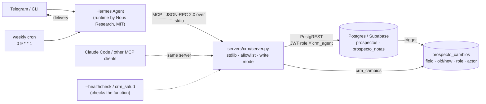

# agent-crm-mcp

Dependency-free MCP servers (Python standard library, JSON-RPC over stdio) that let an LLM agent read and write a Postgres CRM through a field allowlist. The repository also includes the audit trail that proves what the agent did and did not do.

> **Status in one line.** The MCP server and its unit tests run and pass. The database-level guarantees (column grants, audit filter, note author) are written in SQL and covered by integration tests that **have not run yet**; they are designed, not proven, until the CI `integration` job is green. See [Honest status](#honest-status).

> **Credits up front.** The agent runtime these servers ran under is [Hermes Agent](https://github.com/NousResearch/hermes-agent) by **Nous Research** (MIT). I did not build it. This repository contains the MCP servers, the database side and the operational tooling around them.

## The problem

A conversational agent, reached over Telegram or a CLI, has to look up and update a prospecting CRM **without being able to damage it**. Afterwards, someone has to be able to **prove** which changes came from the agent, which from people and which from scripts.

## What is here

- **`servers/crm/server.py`**: an MCP server with 10 tools and no dependencies.
  - Reads: `crm_buscar`, `crm_hoy`, `crm_pipeline`, `crm_consulta`, `crm_siguiente_llamada`.
  - Bounded writes: `crm_actualizar_estado`, `crm_programar_siguiente_paso`, `crm_apuntar_nota`.
  - Audit: `crm_cambios`. Health: `crm_salud`.
- **`supabase/migrations/0001_crm_min.sql`**: a minimal schema with a restricted `crm_agent` role, column-level grants that repeat the allowlist, and a trigger that records the role and actor of every change. Not yet applied to a real database (see the status note above).
- **`supabase/seed_data.json`**: synthetic seed data: 32 invented firms, `example.com` addresses, phone numbers from the Ofcom drama range, and one planted prompt-injection string.
- **Tests:**
  - unit tests against a fake PostgREST (`pytest`);
  - Postgres integration tests for the database guarantees, written for a CI job whose first run is still pending;
  - a smoke script;
  - an offline demo.
- **Monitoring:** `--healthcheck`, plus launchd and cron alert examples and a runtime-log watcher. These came out of a [20-day silent outage](docs/postmortem-mcp-parked.md).
- **Client examples** with placeholders for Hermes Agent and Claude Code.
- **`servers/ghl_readonly/`** (optional): a read-only adapter for the GoHighLevel API with synthetic fixtures.

## Architecture



Each safety layer holds even if the one above it fails:

1. **Tool contract.** Only the allowlisted fields can be written, and there are no deletes. A prospect is resolved by name, and the match must be unique: the server never guesses.
2. **Write mode.** `CRM_WRITE_MODE=off|dry_run|on` defaults to `off`, and each process has a write budget (`CRM_MAX_WRITES`). `dry_run` returns the diff without writing.
3. **Database** (designed; the integration tests that check it have not run yet). The agent authenticates as `crm_agent` and never as `service_role`. Column grants repeat the allowlist, so that a server bug still cannot write other columns. The agent cannot delete, cannot write the audit table, cannot read audit rows about columns it is not allowed to see, and cannot choose a note's author.
4. **Audit.** A trigger writes one row per changed field, with the effective role, the session user and the `actor` claim from the JWT.

More detail: [docs/architecture.md](docs/architecture.md) · [docs/decisions.md](docs/decisions.md).

## Quick start

Requires Python ≥ 3.11 and nothing else. On macOS the system `python3` is 3.9; use a newer one (for example from Homebrew) and pass it as `PYTHON=... bash scripts/smoke.sh`.

```bash
# No database needed
bash scripts/smoke.sh                  # protocol + healthcheck against the fake PostgREST
python3 scripts/demo_offline.py        # scripted demo: off -> dry_run -> on -> audit

# Tests and lint, with the same pinned versions as CI
python3 -m venv .venv && .venv/bin/pip install -e ".[dev]"
.venv/bin/pytest -q
.venv/bin/ruff check . && .venv/bin/ruff format --check . && .venv/bin/mypy
```

With a real local database (**not verified yet**: no Supabase CLI or Docker was available where this repository was prepared). Follow option A in [docs/running-with-postgres.md](docs/running-with-postgres.md); in short:

```bash
supabase init                          # once: creates supabase/config.toml (not versioned)
supabase start && supabase db reset    # migration + synthetic seed
supabase status                        # local API URL, anon key and JWT secret
export PGRST_JWT_SECRET='<JWT secret from supabase status>'
export CRM_SUPABASE_URL='http://127.0.0.1:54321' CRM_API_KEY='<anon key>'
export CRM_AGENT_TOKEN="$(python3 scripts/mint_agent_jwt.py --actor demo-agent)"
python3 servers/crm/server.py --healthcheck
```

To keep the values in a file instead, copy `.env.example` (names only), fill it in, `chmod 600` it, pass it with `--env-file`, and never commit it.

Register the server in a client with one of the examples:
- **Claude Code:** `examples/claude-code/.mcp.example.json`
- **Hermes Agent:** `examples/hermes/config.example.yaml` (only the `mcp_servers` block)
- **Hermes cron:** `examples/hermes/cron-job.example.json` and `cron-canary.example.json`

### Configuration (environment only)

| Variable | Meaning |
|---|---|
| `CRM_SUPABASE_URL` | Supabase or PostgREST base URL |
| `CRM_REST_PATH` | Empty or unset: `/rest/v1` (Supabase). `/` for plain PostgREST without a prefix |
| `CRM_AGENT_TOKEN` | JWT with `role=crm_agent` (see `scripts/mint_agent_jwt.py`). **Never** a `service_role` key |
| `CRM_API_KEY` | Public `apikey` header (the Supabase anon key); defaults to the token |
| `CRM_WRITE_MODE` | `off` (default) · `dry_run` · `on` |
| `CRM_MAX_WRITES` | Writes allowed per server process (default 20) |
| `CRM_TIMEOUT_SECONDS`, `CRM_LOG_LEVEL`, `CRM_TABLE_*` | Optional |

The server never searches for `.env` files on its own. `--env-file` accepts only `CRM_*` keys and never overrides the environment. Logs are JSON lines on stderr, with no tool arguments and credentials redacted.

## Health checks

`python3 servers/crm/server.py --healthcheck` runs real reads through the tool code path, prints a JSON report and exits with `0` (ok), `1` (backend error) or `2` (misconfigured).

- `scripts/healthcheck-alert.sh` and `examples/monitoring/` (launchd and cron) run it every 15 minutes and send a webhook or syslog alert when it fails.
- A fresh-process check cannot see a runtime whose MCP session is stuck. For that case, use the `crm_salud` canary (`examples/hermes/cron-canary.example.json`) with a dead-man's switch, and `scripts/watch-runtime-log.sh`.

## Prompt injection

Prospect data includes text scraped from third-party websites, and notes typed by other people. A web page can therefore try to instruct the agent: the seed includes a firm whose findings say *"IGNORE ALL PREVIOUS INSTRUCTIONS…"*.

What this server does:
- Scraped findings, website, proposal, notes, next steps, audit values and every multi-prospect listing are wrapped in `<untrusted source="…">` blocks. Nested `untrusted` tags are escaped in any letter case.
- Prospect names and cities in the heading of a single card and in error messages are **not** wrapped; like every other field, they are flattened to one line with a length cap.
- Tool descriptions and the `initialize` instructions tell the model that those blocks are data.
- Even if the model is fooled, the damage is bounded:
  - writes are `off` by default;
  - the write budget is small;
  - no deletes exist;
  - only six columns are writable: the server refuses the rest, and the migration's column grants are designed to refuse them again (integration tests pending);
  - name resolution refuses ambiguous targets;
  - every change is audited with the agent's identity.

What it does **not** do: delimiting text reduces the risk but does not eliminate it. The agent runtime also needs its own guardrails:
- give scheduled jobs the read-only tool subset (see `tools.include` in the Hermes example);
- keep `dry_run` until you trust the model;
- run the runtime's terminal tool in a container instead of on the host;
- enable the runtime's tool-loop hard stop (in the Hermes version used, `terminal.backend` and `tool_loop_guardrails.hard_stop_enabled`).

## Honest status

The prototype (`prototype/crm_server_v0.py`) ran against a real CRM in August 2026. That dataset is **not** published. All usage figures below are aggregates taken before 13 Sep 2026 (the incident timeline runs until the fix on 15 Sep); details are in [docs/evidence.md](docs/evidence.md).

**Demonstrated capability** (worked end to end at least once, with evidence):

| Capability | Evidence |
|---|---|
| Agent reads through MCP | 69 tool calls from Hermes Agent |
| Agent writes a note | 1 note written, out of 3 attempts |
| Audit trail | 102 audit rows, **0** written with the agent's credential |
| Cron → CRM → Telegram with data | 1 complete run |
| Provider failover during that run | The cloud model provider returned HTTP 503; the runtime switched to a local model, which called the CRM tool, and the answer was delivered. The failover is a Hermes Agent feature that I configured |
| The same hand-written server pattern works under different MCP clients | 3 clients: Hermes Agent, OpenClaw, Claude Code. The CRM server itself was used only from Hermes |

**Not demonstrated in real use:**
- **Status or next-step changes by the agent:** 0 calls. In this repository these write paths are covered only by unit tests against the fake backend. The CI integration tests are written for them but have not run yet (see the next list).

**Not sustained:**
- Agent use of the CRM: 2 days.
- The weekly cron ran 5 times on 3 Mondays before 13 Sep, and only 1 of those runs carried CRM data.
- One run lost its MCP connection midway and still delivered a message without CRM data, and the scheduler counted it as a normal run. That is why this repository adds an in-band canary instead of trusting the job status.

**Incident:** a 20-day silent outage in the runtime ([postmortem](docs/postmortem-mcp-parked.md)).

**What this public version adds, and how far it is verified:**
- The restricted identity, validation, write modes, healthcheck and structured logging are new.
- The unit tests, `ruff` and `mypy` pass locally on Python 3.11 to 3.14, and `scripts/smoke.sh` passes. CI (lint, test matrix, secret scan) is configured but has not run yet, because the repository has not been pushed.
- **The Postgres integration tests (`tests/integration/`) have not been executed yet.** No Postgres, Docker or Supabase CLI was available where this repository was prepared. They run in the CI `integration` job, so until that job is green, treat the database-level guarantees as designed and cross-checked against the grant text, not as proven.

## Limitations

- **Single tenant.** One CRM and one agent identity per server process.
- **Local stdio only.** There is no remote transport, authentication layer or rate limiting.
- **Depends on the model.** Reliability depends on how well the model follows the tool protocol. In real use, one cron run hit a 766-second inactivity timeout, and background worker sessions on a low-cost paid model (not a free tier) read the CRM but did not complete the task protocol in 4 of 4 runs. Whether that was the model or the prompt was not isolated.
- **Token minting.** `mint_agent_jwt.py` covers HS256 (local or self-hosted PostgREST). Hosted Supabase with asymmetric signing keys has not been tested.
- **No load tests.** The write budget is per process.

## Glossary (Spanish identifiers → English)

| Spanish | English |
|---|---|
| `prospectos` / `prospecto_notas` / `prospecto_cambios` | prospects / prospect notes / prospect changes (audit log) |
| `estado`: `nuevo`, `contactado`, `respondido`, `agendado`, `auditoria`, `propuesta`, `cerrado` | stage: new, contacted, replied, meeting booked, discovery audit, proposal, closed |
| `resultado`: `ganado` / `perdido`; `motivo_cierre` | outcome: won / lost; close reason |
| `proximo_paso`, `proxima_fecha`, `fecha_ultimo_contacto` | next step, next-step date, last contact date |
| `nombre`, `ciudad`, `telefono`, `tamano`, `canal`, `hallazgos`, `propuesta` | name, city, phone, company size, channel, (website) findings, proposed angle |
| `nota`, `cuerpo`, `autor` | note, body, author |
| `rol`, `usuario_sesion`, `actor`, `operacion`, `campo`, `valor_antes` / `valor_despues` | database role, session user, caller identity, operation, field, old / new value |
| `CAMPOS_ESCRIBIBLES` | writable fields (the allowlist) |
| `crm_buscar`, `crm_hoy`, `crm_pipeline`, `crm_consulta`, `crm_siguiente_llamada` | find, due today, pipeline, query, next call |
| `crm_actualizar_estado`, `crm_programar_siguiente_paso`, `crm_apuntar_nota` | update stage, schedule next step, add note |
| `crm_cambios`, `crm_salud` | changes (audit), health |
| `limite`, `desde`, `score_minimo`, `solo_telefono`, `con_email` | limit, since, minimum score, phone only, has email |
| `asesoría`, `gestoría`, `despacho` | advisory firm, administrative-services firm, professional office |

## Credits and third parties

- [Hermes Agent](https://github.com/NousResearch/hermes-agent): the agent runtime, by Nous Research (MIT). Not part of this repository.
- The [Model Context Protocol](https://modelcontextprotocol.io) specification (open). The servers implement its stdio transport and tool methods by hand.
- [PostgREST](https://postgrest.org) and [Supabase](https://supabase.com), used as the database HTTP layer.
- [OpenClaw](https://github.com/openclaw/openclaw) and [Claude Code](https://www.anthropic.com/claude-code): MCP clients that ran servers from this family.
- GoHighLevel is a third-party SaaS product. The adapter uses its public API shapes, and its fixtures are invented.
- Parts of this repository were written with an AI coding assistant (Claude); the commits are co-authored accordingly.

## License

[MIT](LICENSE)
