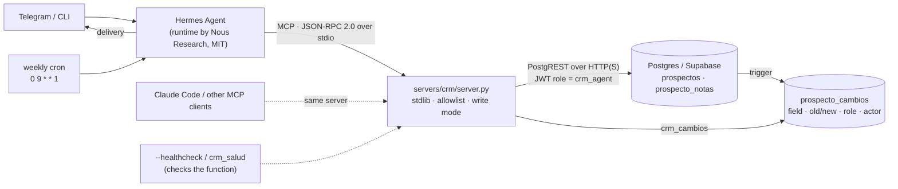

# Architecture

Only `servers/`, `supabase/`, `scripts/` and `examples/` belong to this repository. Hermes Agent, Claude Code, PostgREST, Supabase and Telegram are third-party.

## Request path of a write

1. The MCP client sends `tools/call crm_actualizar_estado {"nombre": "...", "estado": "contactado"}`.
2. `CrmServer.handle` checks the JSON-RPC shape and finds the tool. Unknown tools return `-32602`, unknown methods return `-32601`, and invalid JSON returns `-32700`.
3. The tool function validates its arguments: no unknown keys, enums, lengths, dates. Validation errors come back as `isError: true` with a message the model can act on.
4. `_require_write_mode` refuses the call when `CRM_WRITE_MODE=off`.
5. `resolve()` turns the name into exactly one id, or returns an error.
6. The server reads the current values and computes the diff. `dry_run` stops here and returns the diff.
7. `_spend_write` enforces `CRM_MAX_WRITES`.
8. `_patch` refuses any field outside `CAMPOS_ESCRIBIBLES` and sends `PATCH /prospectos?id=eq.<id>`.
9. PostgREST switches to role `crm_agent`. Postgres checks the column grant, the RLS policy and the check constraints.
10. The `registrar_cambio_prospecto` trigger writes one audit row per changed field, with `rol`, `usuario_sesion` and `actor`.
11. The server checks that exactly one row was updated and returns the diff.

Every call writes one `tool_call` JSON line to stderr with the tool name, kind, success, error kind, duration and write-mode counters. Arguments and results are never logged.

## Files

| Path | Role |
|---|---|
| `servers/crm/server.py` | The MCP server (10 tools) and the `--healthcheck` CLI |
| `servers/ghl_readonly/` | Optional read-only adapter for a SaaS CRM API (7 tools), with synthetic fixtures |
| `supabase/migrations/0001_crm_min.sql` | Minimal schema, `crm_agent` role, grants, RLS and triggers |
| `supabase/seed_data.json` → `seed.sql` | Synthetic data, generated with `python -m devtools.seed` |
| `devtools/fake_postgrest.py` | In-memory PostgREST imitation for tests and demos (not a security boundary) |
| `devtools/mcp_client.py` | Minimal stdio MCP client used by tests and the demo |
| `scripts/` | Smoke test, offline demo, JWT minting, alerting |
| `tests/` | Unit tests; `tests/integration/` needs real Postgres and PostgREST |
| `prototype/crm_server_v0.py` | The August 2026 prototype, kept for provenance |
